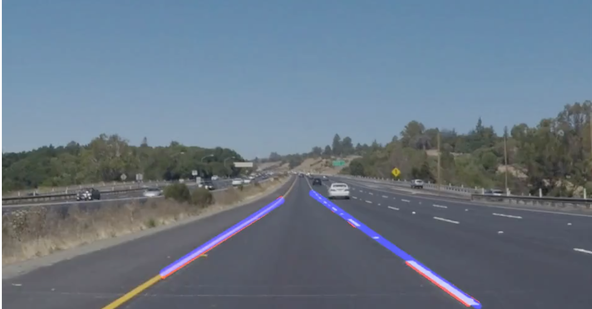

# **Finding Lane Lines on the Road**

### Goals for the project
The goals / steps of this project are the following:
* Make a pipeline that finds lane lines on the road

---

### Reflection

My pipeline consisted of 5 steps. First, I converted the images to grayscale, then I did Gaussian blur for the grayscale image then I did the canny transform to find the edges depending on the gradient. After that I defined the region of interest as the masked image. Then I used the Hough space to find the lines.

The first part of the project was to find those lines of the image, then using OpenCV library we applied this method to a video as the video is series of images.

In the second part of the project, I extrapolate the found lines by grouping the lines into two groups based on the sign of the slopes. Below is an example of
the extrapolated line in the blue colors.

### 2. Identify potential shortcomings with your current pipeline

One of the potential shortcomings is that in the masking process, we applied
a pre-defined mask where in the real world this mask can differ in terms of coordinates

### 3. Suggest possible improvements to your pipeline

A possible improvement would be to have the masking of the image done depending on the
car position not a pre-defined region. Another improvement can be detecting lines and knowing the colors of the lines.
